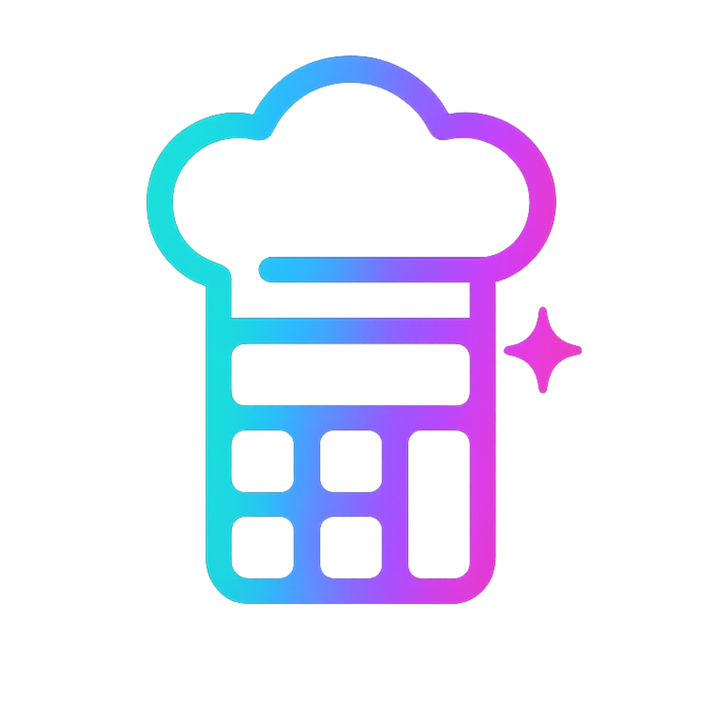
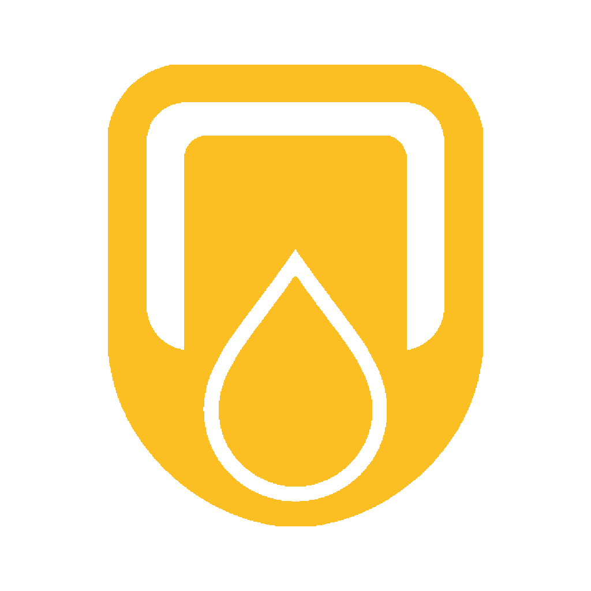

 

 

---

### About

I'm a **software engineer** based in **Málaga**. I design, build, and operate end-to-end products where mobile interfaces, AI queues, billing, data, and observability behave like one living system.

I don't ship demos — I ship products with users, payments, paywalls, async pipelines, and metrics. Three of them are below.

---

### What I'm shipping

<table>
  <thead>
    <tr>
      <th width="33%" align="center">ScanCal</th>
      <th width="33%" align="center">ContentDrop</th>
      <th width="33%" align="center">Cuotia</th>
    </tr>
  </thead>
  <tbody>
    <tr>
      <td align="center">
        
      </td>
      <td align="center">
        
      </td>
      <td align="center">
        
      </td>
    </tr>
    <tr>
      <td valign="top">
        <strong>AI nutrition that works like a product system, not a demo.</strong>
          
        Multimodal food scanning · async AI jobs · digital twin projections · coaching metrics · credits · subscriptions · HealthKit / Health Connect.
          
        <code>React Native</code> <code>Go</code> <code>PostgreSQL</code> <code>Redis</code> <code>Prometheus</code>
          
        <a href="https://www.scancal.app">scancal.app →</a>
      </td>
      <td valign="top">
        <strong>A social content engine with generation, approval, publishing, and analytics.</strong>
          
        AI content generation · Instagram OAuth · queues · calendars · approval links · Graph API sync · Stripe billing.
          
        <code>Next.js</code> <code>Go + Gin</code> <code>Asynq</code> <code>PostgreSQL</code> <code>Stripe</code>
          
        <a href="https://www.contentdrop.app">contentdrop.app →</a>
      </td>
      <td valign="top">
        <strong>Local-first finance companion for subscriptions, goals, and renewal decisions.</strong>
          
        Subscriptions · upcoming charges · monthly goals · worth-it scoring · Pro cloud sync · push reminders.
          
        <code>Expo</code> <code>Go + Chi</code> <code>SQLite</code> <code>RevenueCat</code>
          
        <a href="https://www.cuotia.com">cuotia.com →</a>
      </td>
    </tr>
  </tbody>
</table>

---

### Stack

**Interfaces**

**APIs**

**Data**

**Async & AI**

**Ops & Observability**

**Revenue**

---

### Activity

---

Built end to end. Operated 24/7. <a href="https://ivanmr.dev">See it alive at <strong>ivanmr.dev</strong></a>.

